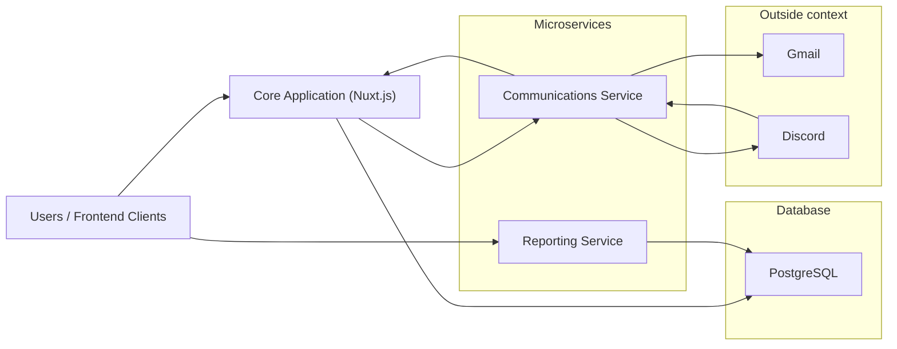
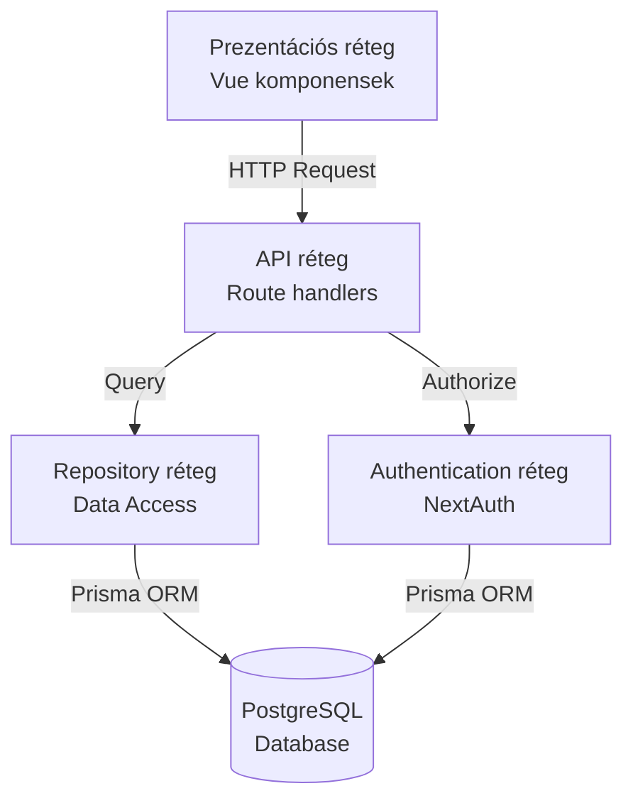

# Rendszerterv

### Munkahelyi nyilvántartási rendszer

# Rendszer célja és környezete

## Feladatkiírás

A projekt célja egy olyan munkaidő napló webes alkalmazás létrehozása, amely megkönnyíti a projektek menedzselését, és azokról statisztikákat állít elő egy vállalat dolgozói számára.
A rendszerben felvehetőek projektek, amelyeknek van egy kezdési, és lehet egy tervezett befejezési dátuma. Ezek a projektek megtekinthetőek egy naptár nézetben, illetve az alkalmazottak minden eseményükhöz (pl. megbeszélés, feladatok) rögzíthetik, hogy melyik projekttel foglalkoztak. Emellett a dolgozók a naptárba felvehetik a tervezett szabadnapjaikat, amelyeket a közvetlen felettesüknek kell jóváhagynia.
A felettesek megnézhetik a beosztottjaik jóváhagyásra váró szabadnapjait, illetve amikor azok felvételre kerülnek a naptárba, arról E-Mail értesítést is kapnak. Opcionális célunk, hogy E-Mail mellett más értesítési formák is megvalósításra kerüljenek, elsősorban Discord értesítés formájában.

## Funkciók

- **Projektek kezelése**
  - Új projekt létrehozása (név, kezdési dátum, tervezett befejezési dátum)
  - Projektek megtekintése (lista és részletes nézet)
  - Résztvevők hozzáadása a projekthez
  - Résztvevők eltávolítása a projektből
  - Projekt lezárása (tényleges befejezési dátum rögzítése)
- **Feladatok kezelése**
  - Feladat létrehozása projekthez rendelten
  - Feladat részleteinek megtekintése
  - Feladat hozzárendelése dolgozóhoz
  - Feladat hozzárendelés módosítása vagy törlése
  - Feladat státuszának változtatása (befejezett/folyamatban)
  - Feladat törlése (csak létrehozó által)
- **Munkaidő nyilvántartás**
  - Munkaidő bejegyzések rögzítése feladatokhoz
  - Rögzített adatok: dátum, óraszám, megjegyzés
  - Munkaidő bejegyzések megtekintése
  - Saját munkaidő bejegyzések törlése
- **Megbeszélések**
  - Megbeszélés létrehozása
  - Résztvevők hozzáadása a megbeszéléshez
  - Kezdési és befejezési időpont megadása
- **Szabadságok kezelése**
  - Szabadság igénylés létrehozása
  - Szabadság jóváhagyása vagy elutasítása (menedzser által)
  - Jóváhagyásra váró szabadságok listázása
- **Adminisztrációs felület (csak menedzsereknek)**
  - Dolgozók munkaidő adminisztrációjának megtekintése
  - Szűrés év és hónap alapján
  - Adminisztrált órák és kötelező órák összehasonlítása
  - Szabadságok figyelembevétele a kötelező órákból
  - Státusz jelzés (elegendő/hiányos/nincs bejegyzés)
- **Naptár nézet**
  - Meetingek, szabadságok és események megtekintése a naptárban
  - Új meeting hozzáadása és módosítása
  - Új szabadság hozzáadása és módosítása
  - Új esemény hozzáadása és módosítása
- **Felhasználói rendszer**
  - Bejelentkezés Google OAuth-al
  - Bejelentkezés email és jelszóval
  - Szerepkör alapú jogosultságkezelés (Menedzser, Alkalmazott)
- **Értesítések**
  - Email értesítések szabadság igénylésekről
  - Discord értesítések (opcionális)

- **Riportok**

## Rendszer környezete

A rendszer egy modern webes alkalmazás, amely három fő komponensből áll. A központi alkalmazás egy Nuxt.js alapú full-stack web alkalmazás, amely a felhasználói felületet (Vue.js komponensek), az üzleti logikát és az API végpontokat egyaránt tartalmazza. Az alkalmazás PostgreSQL relációs adatbázist használ az adatok tárolására, amely Prisma ORM segítségével kerül elérésre.

A hitelesítés NextAuth (Auth.js) könyvtárral van megvalósítva, amely támogatja mind a Google OAuth alapú bejelentkezést, mind az email-jelszó páros hitelesítést. A munkamenetek JWT tokenekkel vannak kezelve, biztosítva a biztonságos felhasználói azonosítást. A rendszer szerepkör alapú hozzáférés-vezérlést (RBAC) implementál, két szerepkörrel: Menedzser és Alkalmazott.

Az értesítési szolgáltatásokat egy Elixir nyelven írt microservice kezeli, amely felelős az email és Discord értesítések kiküldéséért. Emellett egy Python alapú microservice gondoskodik a riportok és statisztikák generálásáról. A három komponens REST API-kon keresztül kommunikál egymással.

A rendszer Docker compose-al futtatható, megkönnyítve a fejlesztést és a telepítést. A frontend modern, reszponzív felületet biztosít Nuxt UI komponenskönyvtár és TailwindCSS segítségével, támogatva a világos és sötét témákat is.

# Architektúra

## Architektúra áttekintése

### Magas szintű architektúra

A rendszer microservice alapú architektúrát követ, amely három fő komponensből áll:

1. **Core Application** (Nuxt.js) - Központi webes alkalmazás
2. **Communications Service** (Elixir/Phoenix) - Értesítési mikroszerviz
3. **Reporting Service** (Python) - Riportgeneráló mikroszerviz

### Architektúrális döntések és indoklásuk

#### Microservice architektúra

A rendszer microservice alapú felépítést követ, amely az alábbi előnyöket nyújtja:

**Szeparált felelősségek**: Minden mikroszerviz egy konkrét üzleti funkciót lát el (értesítések, riportok), amely egyszerűsíti a karbantartást és fejlesztést.

**Technológiai függetlenség**: Minden szolgáltatás a feladatköréhez jól passzoló technológiával készülhet:

- **Elixir/Phoenix** az értesítési szolgáltatáshoz - kiváló konkurencia kezelés, hibatűrés
- **Python** a riportgeneráláshoz - gazdag adatelemző és statisztikai könyvtárak (pandas, matplotlib)
- **Nuxt.js** a core alkalmazáshoz - teljes stack fejlesztés egyetlen keretrendszerben

**Skálázhatóság**: A komponensek egymástól függetlenül skálázhatók. Például az értesítési szolgáltatás külön skálázható nagy terhelés esetén.

**Hibatűrés**: Egy mikroszerviz hibája nem okozza a teljes rendszer leállását. Ha a riportgeneráló szolgáltatás nem érhető el, a core funkciók továbbra is működnek.

#### REST API kommunikáció

A mikroszervizek közötti kommunikációhoz REST API-kat választottunk:

**Egyszerűség**: A REST jól ismert, széles körben támogatott protokoll, amely megkönnyíti az integrációt.

**Stateless kommunikáció**: Minden kérés független, ami egyszerűsíti a rendszer állapotkezelését.

**Platform függetlenség**: Bármilyen HTTP kliens képes kommunikálni a szolgáltatásokkal.

#### Nuxt.js full-stack keretrendszer

A core alkalmazáshoz a Nuxt.js-t választottuk:

**Unified codebase**: Frontend és backend azonos nyelvben (TypeScript/JavaScript), csökkentve a kontextusváltást.

**Server-Side Rendering (SSR)**: Jobb SEO és gyorsabb kezdeti oldalbetöltés.

**File-based routing**: Az API végpontok és oldalak könyvtárstruktúrán alapuló routing-ja egyszerűsíti a fejlesztést.

**Auto-imports**: Automatikus importálás csökkenti a boilerplate kódot.

**Type safety**: TypeScript támogatás az egész stacken keresztül.

#### PostgreSQL adatbázis

Relációs adatbázist választottunk az alábbi okok miatt:

**ACID tulajdonságok**: Tranzakciós biztonság kritikus a munkaidő-nyilvántartásnál.

**Komplex kapcsolatok**: A rendszerben számos entitás áll kapcsolatban (felhasználók, projektek, feladatok, munkaidő bejegyzések).

**Strukturált adatok**: Az adatok sémája jól definiált és stabil.

**Prisma ORM integráció**: Type-safe adatbázis hozzáférés, automatikus migrációk.

#### JWT alapú autentikáció

A munkamenet kezeléshez JWT tokeneket használunk:

**Mikroszerviz kompatibilitás**: A tokenek könnyen validálhatók a különböző szolgáltatásokban.

**CredentialsProvider támogatás**: Lehetővé teszi mind az OAuth, mind az email-jelszó alapú bejelentkezést.

**Biztonságos**: A tokenek titkosítva tartalmazzák a felhasználói információkat, rövidített élettartammal.

## Rétegek leírása

A Core Application többrétegű architektúrát követ, amely egyértelműen elkülöníti a különböző felelősségeket. Az alkalmazás rétegei alulról felfelé:

### Adatbázis réteg (Database Layer)

Ez a legalsó réteg, amely a PostgreSQL adatbázist tartalmazza. A Prisma ORM biztosítja az adatbázis séma kezelését és a migrációkat. Az adatbázis tárolja az összes perzisztens adatot: felhasználókat, projekteket, feladatokat, munkaidő bejegyzéseket és egyéb entitásokat.

**Prisma séma** (`/prisma/schema.prisma`):

- Típusbiztos adatmodell definíciók
- Kapcsolatok és megszorítások definiálása
- Automatikus migráció generálás
- Automatikus seedelés biztosítása

**Adatmodell (Entity-Relationship Diagram)**:

**Főbb entitások**:

- **User**: Felhasználók, hierarchikus manager-employee kapcsolattal, szerepkör támogatással (EMPLOYEE, MANAGER role-ok)
- **Account**: OAuth provider fiókok (Google, Discord)
- **Session**: Felhasználói munkamenetek (JWT esetén nem használt)
- **Project**: Projektek kezdési és befejezési dátumokkal
- **UserProject**: Kapcsoló tábla felhasználók és projektek között (many-to-many)
- **Task**: Többcélú entitás - feladatok, megbeszélések, szabadságok, egyéni feladatok
- **TimeEntry**: Munkaidő bejegyzések feladatokhoz rendelve
- **MeetingParticipant**: Kapcsolótábla egy megbeszélés és résztvevői között

### Repository réteg (Data Access Layer)

A repository réteg biztosítja az adathozzáférési logikát. Minden entitáshoz tartozik egy repository, amely elrejti a Prisma specifikus implementációt.

**Felelősségek**:

- CRUD műveletek implementálása
- Adatbázis lekérdezések összeállítása
- Kapcsolódó entitások betöltése (includes, relations)
- Adatbázis hibák kezelése

**Főbb repository-k**:

- `userRepository.ts` - Felhasználók kezelése
- `projectRepository.ts` - Projektek kezelése
- `taskRepository.ts` - Feladatok kezelése
- `timeEntryRepository.ts` - Munkaidő bejegyzések kezelése
- `userProjectRepository.ts` - Felhasználó-projekt kapcsolatok

### Service réteg (Business Logic Layer)

**Jelenlegi implementáció**:

A Core Application esetében a service réteg **jelenleg nincs külön kiválasztva**, mivel az alkalmazás főként CRUD műveleteket végez, ahol az üzleti logika minimális. A legtöbb endpoint esetében a logika elsősorban **validációból** áll (pl. autentikáció ellenőrzés, jogosultság ellenőrzés, input validálás), amely közvetlenül az API rétegben van implementálva.

**Komplex üzleti logika elhelyezése**:

A rendszer architektúrájában a jelentős üzleti logika a **microservice-ekben** található:

- **Communications Service** (Elixir): Értesítési szabályok, email template generálás, Discord integráció logika
- **Reporting Service** (Python): Statisztikai számítások, riportgenerálás, adatelemzés

A Core Application felelőssége ezért elsősorban:

- Adatok perzisztálása és lekérése
- Felhasználói hitelesítés és jogosultságkezelés
- Alapvető input validáció
- Mikroszervizek koordinálása REST API hívásokon keresztül

**Jövőbeli fejlesztés**: Amennyiben a Core Application-ben több komplex üzleti logika jelenne meg (pl. összetett munkaidő számítások, automatikus projekt értékelések), akkor érdemes lenne a service réteget kiemelni az API handler-ekből a jobb szeparáció és tesztelhetőség érdekében.

### API réteg (Route Handlers)

Az API réteg (`/server/api/`) tartalmazza a HTTP végpontokat. Nuxt.js file-based routing rendszert használ, ahol a fájlstruktúra határozza meg az endpoint-okat.

**Felelősségek**:

- HTTP kérések fogadása
- Autentikáció és autorizáció ellenőrzése
- Request validálás
- Repositoryk hívása
- Response formázás
- HTTP státuszkódok kezelése

### Authentication réteg

Az autentikáció NextAuth (Auth.js) könyvtárral van implementálva (`/server/api/auth/[...].ts`).
Minden endpoint-ot csak bejelentkezett felhasználók érnek el. Az adott felhasználó jogosultsága validálva van az egyes kéréseknél. PL.: Task-ot csak a létrehozója törölhet

**Támogatott provider-ek**:

- Google OAuth 2.0
- Discord OAuth
- Email-jelszó (Credentials Provider)

**JWT munkamenet**:

- Stateless session kezelés
- Token tartalmazza: user id, email, name, role, image
- Biztonságos titkosítás a NEXTAUTH_SECRET-tel

### Prezentációs réteg (Frontend)

A frontend Vue.js komponensekből áll, Nuxt.js keretrendszerben (`/app/`).

**Komponensek** (`/app/components/`):

- `ProjectCard.vue` - Projekt megjelenítés
- `TimeAdministrationCard.vue` - Munkaidő adminisztráció lista elem
- `AddTimeEntryModal.vue` - Munkaidő rögzítés modal
- `TaskAssigneeModal.vue` - Feladat hozzárendelés modal
- És további komponensek...

**Oldalak** (`/app/pages/`):

- `login/` - Bejelentkezés
  

  

  

- `projects/` - Projekt menedzsment oldalak
  

  

  

  

- `tasks/` - Feladat kezelés oldalak
  

  

  

- `administration/` - Adminisztrációs felület
  

  

  

- `approvals/` - Jóváhagyások
  

  

  

- `calendar/` - naptár nézet
  

  

  

  - új esemény létrehozása
    

  

    

  - új meeting létrehozása
    

  

  

  

    

  - új szabadság létrehozása
    

  

    

  - a módosító felületeken ugyanezek jönnek be, az adatok betöltésével:
    

  

    

**Composable-ök** (`/app/composables/`):

- `useUser.ts` - A felhasználó adatainak kiolvasását könnyíti.

**UI könyvtár**: Nuxt UI komponensek TailwindCSS-el

- Sötét/világos téma támogatás
- Reszponzív design
- Előre elkészített gyakran használt UI komponenesek. (Card, DropDown ...)

**Naptár könyvtár**: FullCalendar - robusztus és rugalmas naptárkönyvtár

  - Többféle nézet: Támogatja a fő naptárnézeteket, mint a hónap, hét (időráccsal vagy anélkül), nap és a különböző lista nézetek

  - Interaktivitás: Támogatja az eseményekkel való interakciót (pl. drag and drop, kattintás). 

### Rétegek közötti kommunikáció

**Elvek**:

- **Separation of Concerns**: Minden réteg egyetlen felelősséggel rendelkezik
- **Dependency Direction**: Fentről lefelé (UI → API → Service → Repository → DB)
- **Abstraction**: Minden réteg elrejti az implementációs részleteket
- **Testability**: Rétegek külön-külön unit tesztelhetők

## Microsevice-ek

A rendszer két különálló microserviceszel egészül ki, amelyek a Core Application-től függetlenül futnak és specifikus üzleti funkciókat látnak el.

### Comms Szolgáltatás – (Elixir/Phoenix)

#### 1. Cél és Hatókör

- E‑mailek küldése üzleti események (feladat kiosztás, projekt státusz, szabadság kérés stb.) alapján.
- Discord slash command / interaction kérések fogadása, validálása, aláírás ellenőrzése és válasz generálása.

#### 2. Fő Összetevők

##### E‑mail

- Swoosh (`Comms.Mailer`) a küldéshez; konfiguráció `:comms` OTP alkalmazás alatt (pl. `smtp_from_email`).
- Sablonok: `priv/templates/email/*.html.eex` – klasszikus `.eex`. Minden sablon a várt assign kommenttel indul (pl. `# assigner: %{name: String, email: String}`).
- Builder: `Comms.Notifications` modul állítja össze a `Swoosh.Email` struktúrát (from, to, subject, body). A body renderelést Phoenix sablonmotor végzi a megfelelő path alapján.

##### Discord

- Router pipeline `:discord` és `CommsWeb.Plugs.VerifyDiscordSignature` plug a Discord aláírás ellenőrzéséhez (fejlécek: `X-Signature-Ed25519`, `X-Signature-Timestamp`).
- Végpontok:
  - `POST /discord/interactions` – slash command / component interactions.

#### 3. Adat és Sablonkezelés

- Sablonváltozók: közvetlenül a `render` híváskor kerülnek átadásra assign mapként; a sablonok végeznek interpolációt.
- Discord válaszok: általában JSON payload a Discord API elvárásai szerint (type, data). A validáció a signature ellenőrzés és a parancs típus alapján történik.

#### 4. Folyamatok

##### E‑mail Küldés

1. HTTP POST érkezik egy dedikált értesítési végpontra (pl. `/notifications/vacation-request`).
2. Controller / action validálja a minimális mezőket (címzett, JWT, kontextus adatok).
3. `Comms.Notifications` összeállítja a `Swoosh.Email` struktúrát: `from_email()` + dinamikus `to`.
4. Sablon render: `Phoenix.View.render("email/vacation_request.html", assigns)` – generált HTML a levél törzséhez.
5. `Comms.Mailer.deliver(email)` → küldés. Hibánál visszatér `{:error, reason}`.

##### Discord Interaction

1. Discord küld egy HTTP POST-ot az `interactions` végpontra, fejlécekben időbélyeg + aláírás.
2. `VerifyDiscordSignature` plug hitelesíti (Ed25519).
3. Controller dekódolja a JSON-t; slash command név alapján routing / dispatch.
4. Válasz JSON: ack / ephemeral üzenet / follow‑up trigger.
   - Az ephemeral a discord kontextusában azt jelenti, hogy csak a releváns user látja az adott üzenetet

##### Discord Command Telepítés

`mix discord.install_commands` futtatás:

- Ellenőrzi szükséges env változókat.
- Küldi az upsert kérést a Discord API-hoz Req segítségével.
- Siker / hiba logolás, hibánál.

#### 5. Hibakezelés

- E‑mail: Swoosh visszatérési érték alapján döntés. Nincs automatikus retry vagy backoff – hiba esetén a hívó fél (felsőbb szolgáltatás) kezeli az újrapróbálkozást.
- Discord: Signature hiba → 401 / 403; ismeretlen parancs → 400 egyszerű üzenettel; parse hiba → 422 JSON.
- Mix task: env hiány esetén `Mix.raise`; API hiba esetén status + body megjelenítés.

#### 6. Biztonság

- Discord aláírás ellenőrzés kötelező; nincs további token validáció a Discord interactions endpointnál.
- E‑mail végpontok: belső (feltételezett) használat – javasolt IP / auth réteg (ha még nincs) a router pipeline-ban.
- Sablonokban nincs futtatható kód injektálás: csak interpoláció a kapott assign értékekkel.

#### 7. Konfiguráció

- SMTP from cím: `Application.get_env(:comms, :smtp_from_email)`.
- Discord env: `DISCORD_APP_ID`, `DISCORD_BOT_TOKEN`.
- Telepítés konténerrel: `Dockerfile`, `docker-compose.yaml` (standard Phoenix release).

#### 8. Egyszerű Metrikák / Logok (Aktuális Állapot)

- Strukturált log: siker / hiba e‑mail küldés, Discord parancs neve, státusz.

#### 10. Tesztelési Fókusz

- Unit: `Comms.Notifications` – helyes `from`, `subject`, sablon változó kitöltés.
- Plug teszt: hamis Discord signature → 403.
- Mix task: mockolt HTTP válasz (Req adapter konfigurációval) siker / hiba.

### Reporting Service (Python)

A riportgeneráló szolgáltatás Python nyelven készült, adatelemzésre és statisztikák előállítására optimalizálva.
A feladata, hogy a Postgre adatbázisunkon elhelyezett aggregált view-k alapján jelentést készítsen az adott menedzserek projektjeiről.  
HTML-ben és PDF-ben generálja ki a jelentéseket, ezeket gRPC és REST végpontokon keresztül lehet lekérdezni.
A jelentések tartalmaznak szöveges adatokat, diagramokat, illetve táblázatokat.

**Felelősségek**:

- Projekt előrehaladás riportok
- Dolgozói teljesítmény összesítők
- Exportálás különböző formátumokba
- Adatvizualizáció (grafikonok, diagramok)

**REST API végpontok**:

- `GET reports/manager/{manager_id}/pdf` - Adott id-val rendelkező menedzser riportjának a generálása pdf-ben.
- `GET reports/manager/{manager_id}/html` - Adott id-val rendelkező menedzser riportjának a generálása html-ben.

## Telepítési leírás

### Development

### Production
