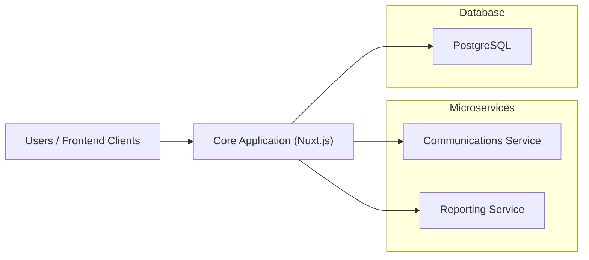
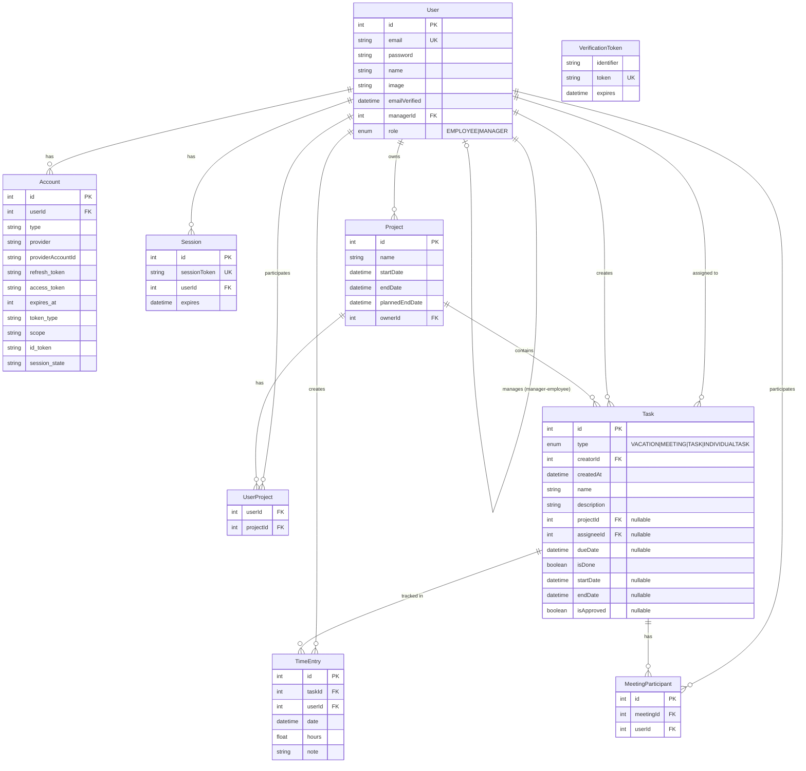
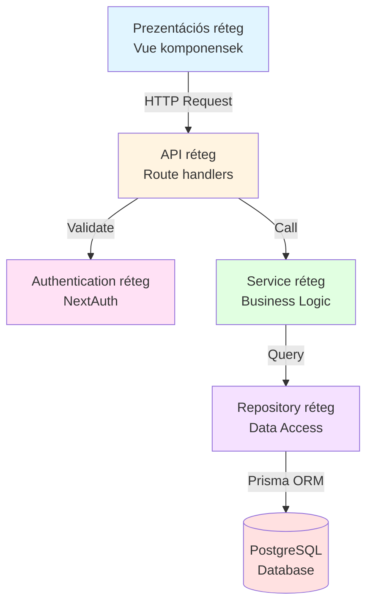

# Rendszerterv


### Munkahelyi nyilvántartási rendszer

# Rendszer célja és környezete

## Feladatkiírás

A projekt célja egy olyan munkaidő napló webes alkalmazás létrehozása, amely megkönnyíti a projektek menedzselését, és azokról statisztikákat állít elő egy vállalat dolgozói számára.
A rendszerben felvehetőek projektek, amelyeknek van egy kezdési, és lehet egy tervezett befejezési dátuma. Ezek a projektek megtekinthetőek egy naptár nézetben, illetve az alkalmazottak minden eseményükhöz (pl. megbeszélés, feladatok) rögzíthetik, hogy melyik projekttel foglalkoztak. Emellett a dolgozók a naptárba felvehetik a tervezett szabadnapjaikat, amelyeket a közvetlen felettesüknek kell jóváhagynia.
A felettesek megnézhetik a beosztottjaik jóváhagyásra váró szabadnapjait, illetve amikor azok felvételre kerülnek a naptárba, arról E-Mail értesítést is kapnak. Opcionális célunk, hogy E-Mail mellett más értesítési formák is megvalósításra kerüljenek, elsősorban Discord értesítés formájában.

## Funkciók

- **Projektek kezelése**
  - Új projekt létrehozása (név, kezdési dátum, tervezett befejezési dátum)
  - Projektek megtekintése (lista és részletes nézet)
  - Résztvevők hozzáadása a projekthez
  - Résztvevők eltávolítása a projektből
  - Projekt lezárása (tényleges befejezési dátum rögzítése)
- **Feladatok kezelése**
  - Feladat létrehozása projekthez rendelten
  - Feladat részleteinek megtekintése
  - Feladat hozzárendelése dolgozóhoz
  - Feladat hozzárendelés módosítása vagy törlése
  - Feladat státuszának változtatása (befejezett/folyamatban)
  - Feladat törlése (csak létrehozó által)
- **Munkaidő nyilvántartás**
  - Munkaidő bejegyzések rögzítése feladatokhoz
  - Rögzített adatok: dátum, óraszám, megjegyzés
  - Munkaidő bejegyzések megtekintése
  - Saját munkaidő bejegyzések törlése
- **Megbeszélések**
  - Megbeszélés létrehozása
  - Résztvevők hozzáadása a megbeszéléshez
  - Kezdési és befejezési időpont megadása
- **Szabadságok kezelése**
  - Szabadság igénylés létrehozása
  - Szabadság jóváhagyása vagy elutasítása (menedzser által)
  - Jóváhagyásra váró szabadságok listázása
- **Adminisztrációs felület (csak menedzsereknek)**
  - Dolgozók munkaidő adminisztrációjának megtekintése
  - Szűrés év és hónap alapján
  - Adminisztrált órák és kötelező órák összehasonlítása
  - Szabadságok figyelembevétele a kötelező órákból
  - Státusz jelzés (elegendő/hiányos/nincs bejegyzés)
- **Naptár nézet**
  - TODO: Fanni
- **Felhasználói rendszer**
  - Bejelentkezés Google OAuth-al
  - Bejelentkezés email és jelszóval
  - Szerepkör alapú jogosultságkezelés (Menedzser, Alkalmazott)
- **Értesítések**
  TODO: Geri
  - Email értesítések szabadság igénylésekről
  - Discord értesítések (opcionális)

## Rendszer környezete

A rendszer egy modern webes alkalmazás, amely három fő komponensből áll. A központi alkalmazás egy Nuxt.js alapú full-stack web alkalmazás, amely a felhasználói felületet (Vue.js komponensek), az üzleti logikát és az API végpontokat egyaránt tartalmazza. Az alkalmazás PostgreSQL relációs adatbázist használ az adatok tárolására, amely Prisma ORM segítségével kerül elérésre.

A hitelesítés NextAuth (Auth.js) könyvtárral van megvalósítva, amely támogatja mind a Google OAuth alapú bejelentkezést, mind az email-jelszó páros hitelesítést. A munkamenetek JWT tokenekkel vannak kezelve, biztosítva a biztonságos felhasználói azonosítást. A rendszer szerepkör alapú hozzáférés-vezérlést (RBAC) implementál, három szerepkörrel: Admin, Menedzser és Alkalmazott.

Az értesítési szolgáltatásokat egy Elixir nyelven írt microservice kezeli, amely felelős az email és Discord értesítések kiküldéséért. Emellett egy Python alapú microservice gondoskodik a riportok és statisztikák generálásáról. A három komponens REST API-kon keresztül kommunikál egymással.

A rendszer Docker konténerekben futtatható, megkönnyítve a fejlesztést és a telepítést. A frontend modern, reszponzív felületet biztosít Nuxt UI komponenskönyvtár és TailwindCSS segítségével, támogatva a világos és sötét témákat is.

# Architektúra

## Architektúra áttekintése

### Magas szintű architektúra

A rendszer mikroszerviz alapú architektúrát követ, amely három fő komponensből áll:

1. **Core Application** (Nuxt.js) - Központi webes alkalmazás
2. **Communications Service** (Elixir/Phoenix) - Értesítési mikroszerviz
3. **Reporting Service** (Python) - Riportgeneráló mikroszerviz



### Architektúrális döntések és indoklásuk

#### Mikroszerviz architektúra

A rendszer mikroszerviz alapú felépítést követ, amely az alábbi előnyöket nyújtja:

**Szeparált felelősségek**: Minden mikroszerviz egy konkrét üzleti funkciót lát el (értesítések, riportok), amely egyszerűsíti a karbantartást és fejlesztést.

**Technológiai függetlenség**: Minden szolgáltatás a feladatához legmegfelelőbb technológiával készülhet:

- **Elixir/Phoenix** az értesítési szolgáltatáshoz - kiváló konkurencia kezelés, hibatűrés
- **Python** a riportgeneráláshoz - gazdag adatelemző és statisztikai könyvtárak (pandas, matplotlib)
- **Nuxt.js** a core alkalmazáshoz - teljes stack fejlesztés egyetlen keretrendszerben

**Skálázhatóság**: A komponensek egymástól függetlenül skálázhatók. Például az értesítési szolgáltatás külön skálázható nagy terhelés esetén.

**Hibatűrés**: Egy mikroszerviz hibája nem okozza a teljes rendszer leállását. Ha a riportgeneráló szolgáltatás nem érhető el, a core funkciók továbbra is működnek.

#### REST API kommunikáció

A mikroszervizek közötti kommunikációhoz REST API-kat választottunk:

**Egyszerűség**: A REST jól ismert, széles körben támogatott protokoll, amely megkönnyíti az integrációt.

**Stateless kommunikáció**: Minden kérés független, ami egyszerűsíti a rendszer állapotkezelését.

**Platform függetlenség**: Bármilyen HTTP kliens képes kommunikálni a szolgáltatásokkal.

#### Nuxt.js full-stack keretrendszer

A core alkalmazáshoz a Nuxt.js-t választottuk:

**Unified codebase**: Frontend és backend azonos nyelvben (TypeScript/JavaScript), csökkentve a kontextusváltást.

**Server-Side Rendering (SSR)**: Jobb SEO és gyorsabb kezdeti oldalbetöltés.

**File-based routing**: Az API végpontok és oldalak könyvtárstruktúrán alapuló routing-ja egyszerűsíti a fejlesztést.

**Auto-imports**: Automatikus importálás csökkenti a boilerplate kódot.

**Type safety**: TypeScript támogatás az egész stacken keresztül.

#### PostgreSQL adatbázis

Relációs adatbázist választottunk az alábbi okok miatt:

**ACID tulajdonságok**: Tranzakciós biztonság kritikus a munkaidő-nyilvántartásnál.

**Komplex kapcsolatok**: A rendszerben számos entitás áll kapcsolatban (felhasználók, projektek, feladatok, munkaidő bejegyzések).

**Strukturált adatok**: Az adatok sémája jól definiált és stabil.

**Prisma ORM integráció**: Type-safe adatbázis hozzáférés, automatikus migrációk.

#### JWT alapú autentikáció

A munkamenet kezeléshez JWT tokeneket használunk:

**Stateless**: A szerver nem tárol session információkat, ami egyszerűsíti a horizontális skálázást.

**Mikroszerviz kompatibilitás**: A tokenek könnyen validálhatók a különböző szolgáltatásokban.

**CredentialsProvider támogatás**: Lehetővé teszi mind az OAuth, mind az email-jelszó alapú bejelentkezést.

**Biztonságos**: A tokenek titkosítva tartalmazzák a felhasználói információkat, rövidített élettartammal.

## Rétegek leírása

A Core Application többrétegű architektúrát követ, amely egyértelműen elkülöníti a különböző felelősségeket. Az alkalmazás rétegei alulról felfelé:

### Adatbázis réteg (Database Layer)

Ez a legalsó réteg, amely a PostgreSQL adatbázist tartalmazza. A Prisma ORM biztosítja az adatbázis séma kezelését és a migrációkat. Az adatbázis tárolja az összes perzisztens adatot: felhasználókat, projekteket, feladatokat, munkaidő bejegyzéseket és egyéb entitásokat.

**Prisma séma** (`/prisma/schema.prisma`):

- Típusbiztos adatmodell definíciók
- Kapcsolatok és megszorítások definiálása
- Automatikus migráció generálás

**Adatmodell (Entity-Relationship Diagram)**:



**Főbb entitások**:

- **User**: Felhasználók, hierarchikus manager-employee kapcsolattal, szerepkör támogatással
- **Account**: OAuth provider fiókok (Google)
- **Session**: Felhasználói munkamenetek (JWT esetén nem használt)
- **Project**: Projektek kezdési és befejezési dátumokkal
- **UserProject**: Összekapcsoló tábla felhasználók és projektek között (many-to-many)
- **Task**: Többcélú entitás - feladatok, megbeszélések, szabadságok, egyéni feladatok
- **TimeEntry**: Munkaidő bejegyzések feladatokhoz rendelve
- **MeetingParticipant**: Megbeszélés résztvevők

### Repository réteg (Data Access Layer)

A repository réteg (`/server/repositories/`) biztosítja az adathozzáférési logikát. Minden entitáshoz tartozik egy repository, amely elrejti a Prisma specifikus implementációt.

**Felelősségek**:

- CRUD műveletek implementálása
- Adatbázis lekérdezések összeállítása
- Kapcsolódó entitások betöltése (includes, relations)
- Adatbázis hibák kezelése

**Főbb repository-k**:

- `userRepository.ts` - Felhasználók kezelése
- `projectRepository.ts` - Projektek kezelése
- `taskRepository.ts` - Feladatok kezelése
- `timeEntryRepository.ts` - Munkaidő bejegyzések kezelése
- `userProjectRepository.ts` - Felhasználó-projekt kapcsolatok

**Példa** (`timeEntryRepository.ts`):

```typescript
export async function createTimeEntry(data: {
  userId: number
  taskId: number
  hours: number
  date: Date
  description?: string
}) {
  return await prisma.timeEntry.create({
    data,
    include: {
      task: true,
      user: true,
    },
  })
}
```

### Service réteg (Business Logic Layer)

A service réteg (`/server/services/`) tartalmazza az üzleti logikát. Ez a réteg koordinálja a repository-kat, alkalmazza az üzleti szabályokat és validációkat.

**Felelősségek**:

- Üzleti szabályok alkalmazása
- Komplex műveletek koordinálása több repository között
- Validációs logika
- Adattranszformáció
- Mikroszerviz hívások koordinálása

**Jelenlegi állapot**: A service réteg részben implementált, több üzleti logika még az API rétegben található (refaktorálás alatt).

### API réteg (Route Handlers)

Az API réteg (`/server/api/`) tartalmazza a HTTP végpontokat. Nuxt.js file-based routing rendszert használ, ahol a fájlstruktúra határozza meg az endpoint-okat.

**Felelősségek**:

- HTTP kérések fogadása
- Autentikáció és autorizáció ellenőrzése
- Request validálás
- Service réteg hívása
- Response formázás
- HTTP státuszkódok kezelése

**Struktúra**:

```
/server/api/
  auth/
    [...].ts          # NextAuth endpoints
  projects/
    index.get.ts      # GET /api/projects - Lista lekérés
    index.post.ts     # POST /api/projects - Létrehozás
    [id].get.ts       # GET /api/projects/:id - Részletek
    [id]/users.post.ts # POST /api/projects/:id/users - Felhasználó hozzáadás
  tasks/
    index.get.ts      # GET /api/tasks
    index.post.ts     # POST /api/tasks
    [id].get.ts       # GET /api/tasks/:id
  time-entries/
    index.post.ts     # POST /api/time-entries
    [id].delete.ts    # DELETE /api/time-entries/:id
  users/
    time-administration.get.ts # GET /api/users/time-administration
```

**Példa endpoint** (`/server/api/time-entries/[id].delete.ts`):

```typescript
export default defineEventHandler(async (event) => {
  const session = await getServerSession(event)
  if (!session?.user) {
    throw createError({
      statusCode: 401,
      message: 'Unauthorized',
    })
  }

  const id = parseInt(event.context.params!.id)
  const timeEntry = await getTimeEntryById(id)

  if (timeEntry.userId !== session.user.id) {
    throw createError({
      statusCode: 403,
      message: 'Forbidden',
    })
  }

  await deleteTimeEntry(id)
  return { success: true }
})
```

### Authentication réteg

Az autentikáció NextAuth (Auth.js) könyvtárral van implementálva (`/server/api/auth/[...].ts`).

**Támogatott provider-ek**:

- Google OAuth 2.0
- Email-jelszó (Credentials Provider)

**JWT munkamenet**:

- Stateless session kezelés
- Token tartalmazza: user id, email, name, role, image
- Biztonságos titkosítás a NEXTAUTH_SECRET-tel

**Szerepkör alapú hozzáférés-vezérlés**:

```typescript
// Middleware ellenőrzés
const session = await getServerSession(event)
if (session?.user?.role !== 'MANAGER') {
  throw createError({ statusCode: 403 })
}
```

### Prezentációs réteg (Frontend)

A frontend Vue.js komponensekből áll, Nuxt.js keretrendszerben (`/app/`).

**Komponensek** (`/app/components/`):

- `ProjectCard.vue` - Projekt megjelenítés
- `TimeAdministrationCard.vue` - Munkaidő adminisztráció lista elem
- `AddTimeEntryModal.vue` - Munkaidő rögzítés modal
- `TaskAssigneeModal.vue` - Feladat hozzárendelés modal
- És további komponensek...

**Oldalak** (`/app/pages/`):

- `index.vue` - Főoldal
- `login/index.vue` - Bejelentkezés
- `projects/` - Projekt menedzsment oldalak
- `tasks/` - Feladat kezelés oldalak
- `administration/` - Adminisztrációs felület
- `approvals/` - Jóváhagyások

**Composable-ök** (`/app/composables/`):

- `useUser.ts` - Felhasználói session kezelés
- `localStore.ts` - Local storage kezelés

**UI könyvtár**: Nuxt UI komponensek TailwindCSS-el

- Sötét/világos téma támogatás
- Reszponzív design
- Formok, modal-ok, card-ok, dropdown-ok

### Rétegek közötti kommunikáció



**Adatfolyam példa** - Munkaidő bejegyzés létrehozása:

1. **UI réteg**: Felhasználó kitölti a formot és submit-ol
2. **API réteg**: `POST /api/time-entries` fogadja a kérést
3. **Auth réteg**: NextAuth validálja a JWT tokent, visszaadja a session-t
4. **API réteg**: Ellenőrzi a jogosultságot (bejelentkezett felhasználó)
5. **Service réteg**: Validálja az adatokat (óraszám > 0, dátum valid, stb.)
6. **Repository réteg**: `createTimeEntry()` Prisma query-t futtat
7. **Database réteg**: PostgreSQL beszúrja az új rekordot
8. **Repository réteg**: Visszaadja a beszúrt entitást
9. **API réteg**: JSON response-t formáz
10. **UI réteg**: Frissíti a komponens állapotát, bezárja a modal-t

**Elvek**:

- **Separation of Concerns**: Minden réteg egyetlen felelősséggel rendelkezik
- **Dependency Direction**: Fentről lefelé (UI → API → Service → Repository → DB)
- **Abstraction**: Minden réteg elrejti az implementációs részleteket
- **Testability**: Rétegek külön-külön unit tesztelhetők (mock-olható függőségek)
